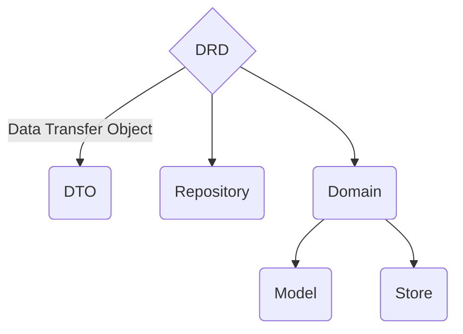
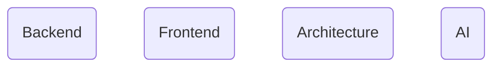

import { Callout } from 'nextra/components'
import { useEffect, useRef } from "react";

# Company that makes things

<em>QUAK - quickly understand another key (where key is the answer)</em>

### Programming don't have to be hard
Click [LEARN](/learn)  in the navbar and start improving yourself with QUAK

## Products

### Architecture

QUAK developed DRD architecture (DTO's Repository Domain) for frontend.

<Callout emoji="ℹ️" type="info">
    DRD is framework agnostic architecture that can be used in any programming language.
    
    DRD split business logic from presentation layer/use case.
</Callout>

#### DRD Architecture Docs

You can check out docs at [DRD Architecture](/learn/architecture/drd)

#### DRD Github Repositories

- [DRD Architecture - Angular example](https://github.com/Walikuperek/DRD-frontend-architecture/tree/master)

### Libraries

<fieldset className="border-muted-dotted mt-5">
  &nbsp;
  

    

      <h2 className="fs-24 text-muted">QUAK Libraries</h2>
    

    

      
      
      
    

  

  &nbsp;
</fieldset>

 
<Callout emoji="👾">
  **QUAK** is providing libraries with framework agnostic aproach.
</Callout>

Visit NPM and search for `@quak.lib/` to find js libraries or click [@quak.lib account](https://www.npmjs.com/~quak.lib) to see list of all.

### Learn

QUAK learn is a place where you can find articles about programming.

<Callout emoji="ℹ️" type="info">
    Visit [QUAK learn](/learn) to start learning.
</Callout>

  <h2 className="fs-24 text-muted">Topics</h2>

