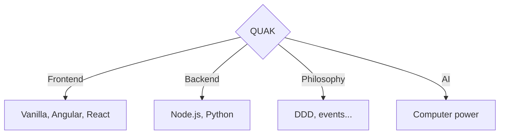

import { useEffect, useRef } from "react";

# Company that makes things

<em>QUAK - quickly understand another key (where key is the answer)</em>

## Programming don't have to be hard
Click [LEARN](/learn)  in the navbar and start improving yourself

## QUAK Libraries

import { Callout } from 'nextra/components'
 
<Callout emoji="👾">
  **QUAK** is providing libraries with framework agnostic aproach.
</Callout>

Visit NPM and search for `@quak.lib/` to find js libraries or click [@quak.lib account](https://www.npmjs.com/~quak.lib) to see list of all.