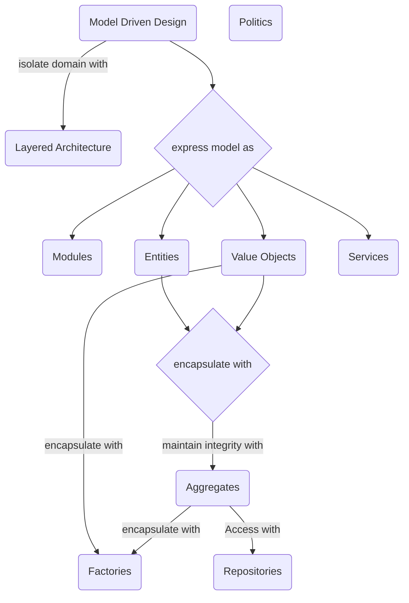

import { Cards, Card, Steps, Tabs } from "nextra/components";
import { LatestReadings } from "../../../components/ui/sections/latest-readings";
import { ArchitectureTag } from "../../../components/tags/architecture";

# Domain Driven Design (DDD)

<section className="w-full rounded-2xl bg-indigo-900 bg-opacity-10 border-2 border-indigo-500 mt-2">
    <article className="flex flex-col align-between h-full relative">
        

            <ArchitectureTag/>
        

        <section className="shadow-lg flex align-center justify-center gap-3 h-full overflow-hidden">
            

                
DDD

                

                <ul>
                    <li className="flex items-center gap-2">
                        <svg xmlns="http://www.w3.org/2000/svg" width="16" height="16" fill="currentColor" className="bi bi-door-open" viewBox="0 0 16 16">
                        <path d="M8.5 10c-.276 0-.5-.448-.5-1s.224-1 .5-1 .5.448.5 1-.224 1-.5 1"/>
                        <path d="M10.828.122A.5.5 0 0 1 11 .5V1h.5A1.5 1.5 0 0 1 13 2.5V15h1.5a.5.5 0 0 1 0 1h-13a.5.5 0 0 1 0-1H3V1.5a.5.5 0 0 1 .43-.495l7-1a.5.5 0 0 1 .398.117M11.5 2H11v13h1V2.5a.5.5 0 0 0-.5-.5M4 1.934V15h6V1.077z"/>
                        </svg>
                        Event
                    </li>
                    <li className="flex items-center gap-2">
                        <svg xmlns="http://www.w3.org/2000/svg" width="16" height="16" fill="currentColor" className="bi bi-person-workspace" viewBox="0 0 16 16">
                            <path d="M4 16s-1 0-1-1 1-4 5-4 5 3 5 4-1 1-1 1zm4-5.95a2.5 2.5 0 1 0 0-5 2.5 2.5 0 0 0 0 5"/>
                            <path d="M2 1a2 2 0 0 0-2 2v9.5A1.5 1.5 0 0 0 1.5 14h.653a5.4 5.4 0 0 1 1.066-2H1V3a1 1 0 0 1 1-1h12a1 1 0 0 1 1 1v9h-2.219c.554.654.89 1.373 1.066 2h.653a1.5 1.5 0 0 0 1.5-1.5V3a2 2 0 0 0-2-2z"/>
                        </svg>
                        Service
                    </li>
                    <li className="flex items-center gap-2">
                        <svg xmlns="http://www.w3.org/2000/svg" width="16" height="16" fill="currentColor" className="bi bi-bank" viewBox="0 0 16 16">
                          <path d="m8 0 6.61 3h.89a.5.5 0 0 1 .5.5v2a.5.5 0 0 1-.5.5H15v7a.5.5 0 0 1 .485.38l.5 2a.498.498 0 0 1-.485.62H.5a.498.498 0 0 1-.485-.62l.5-2A.5.5 0 0 1 1 13V6H.5a.5.5 0 0 1-.5-.5v-2A.5.5 0 0 1 .5 3h.89zM3.777 3h8.447L8 1zM2 6v7h1V6zm2 0v7h2.5V6zm3.5 0v7h1V6zm2 0v7H12V6zM13 6v7h1V6zm2-1V4H1v1zm-.39 9H1.39l-.25 1h13.72z"/>
                        </svg>
                        Aggregate
                    </li>
                    <li className="flex items-center gap-2">
                        <svg xmlns="http://www.w3.org/2000/svg" width="16" height="16" fill="currentColor" className="bi bi-bank" viewBox="0 0 16 16">
                          <path d="m8 0 6.61 3h.89a.5.5 0 0 1 .5.5v2a.5.5 0 0 1-.5.5H15v7a.5.5 0 0 1 .485.38l.5 2a.498.498 0 0 1-.485.62H.5a.498.498 0 0 1-.485-.62l.5-2A.5.5 0 0 1 1 13V6H.5a.5.5 0 0 1-.5-.5v-2A.5.5 0 0 1 .5 3h.89zM3.777 3h8.447L8 1zM2 6v7h1V6zm2 0v7h2.5V6zm3.5 0v7h1V6zm2 0v7H12V6zM13 6v7h1V6zm2-1V4H1v1zm-.39 9H1.39l-.25 1h13.72z"/>
                        </svg>
                        ...
                    </li>
                </ul>
            

        </section>
        <header className="flex flex-col px-4 pb-4 pt-4">
            

                
Kacper Walczak &middot; 04-05-2024

            

            
Lets learn how to use DDD architecture approach.

        </header>
    </article>
</section>

## Introduction

We will take a look at DDD with a practice approach *"learn by examples"*.

It this series we will take a look at examples based on ours client `Product reservation`.

## But why?

Key Indicators for Applying DDD:
- Frequent changes in business requirements.
- High complexity in domain logic, with many interconnected parts.
- A need for collaboration between business and technical teams.
- The system must be maintainable and adaptable over time.
- You have access to domain experts to define and clarify business rules.

## When not?

When not to apply DDD:
- Simple or Small Applications.
  > If you're building a small, straightforward application (like a simple CRUD app, a prototype, or a single-purpose tool), DDD may add unnecessary complexity. In such cases, simpler design patterns or frameworks may be more suitable.

- Short-Lived Projects.
  > For projects with a short lifespan or a limited scope where quick delivery is more critical than long-term maintainability, DDD may be overkill.

- Low Domain Complexity.
  > If the business domain is relatively simple and doesn’t complex hard rules or logic, the overhead of DDD might not be justified. Applications that do not have a deep or evolving domain don't benefit much from DDD.

- Lack of Domain Expertise.
  > DDD relies heavily on domain experts and collaboration. If the domain experts are not available or there is no buy-in from stakeholders to invest time in defining and refining the domain model, DDD won't be effective.

- Tight Deadlines and Budgets.
  > DDD requires upfront investment in understanding the domain, modeling it, and creating a well-structured design. If the project has very tight deadlines or budget constraints, the initial investment required for DDD may not be best decision.

## Building blocks

<Cards>
    <Card icon={<svg xmlns="http://www.w3.org/2000/svg" width="16" height="16" fill="currentColor" viewBox="0 0 16 16">
      <path d="M14.763.075A.5.5 0 0 1 15 .5v15a.5.5 0 0 1-.5.5h-3a.5.5 0 0 1-.5-.5V14h-1v1.5a.5.5 0 0 1-.5.5h-9a.5.5 0 0 1-.5-.5V10a.5.5 0 0 1 .342-.474L6 7.64V4.5a.5.5 0 0 1 .276-.447l8-4a.5.5 0 0 1 .487.022M6 8.694 1 10.36V15h5zM7 15h2v-1.5a.5.5 0 0 1 .5-.5h2a.5.5 0 0 1 .5.5V15h2V1.309l-7 3.5z"/>
      <path d="M2 11h1v1H2zm2 0h1v1H4zm-2 2h1v1H2zm2 0h1v1H4zm4-4h1v1H8zm2 0h1v1h-1zm-2 2h1v1H8zm2 0h1v1h-1zm2-2h1v1h-1zm0 2h1v1h-1zM8 7h1v1H8zm2 0h1v1h-1zm2 0h1v1h-1zM8 5h1v1H8zm2 0h1v1h-1zm2 0h1v1h-1zm0-2h1v1h-1z"/>
    </svg>} title="Modules" href="/learn/architecture/ddd-modules/" />

    <Card icon={<svg xmlns="http://www.w3.org/2000/svg" width="16" height="16" fill="currentColor" viewBox="0 0 16 16">
      <path d="M14.763.075A.5.5 0 0 1 15 .5v15a.5.5 0 0 1-.5.5h-3a.5.5 0 0 1-.5-.5V14h-1v1.5a.5.5 0 0 1-.5.5h-9a.5.5 0 0 1-.5-.5V10a.5.5 0 0 1 .342-.474L6 7.64V4.5a.5.5 0 0 1 .276-.447l8-4a.5.5 0 0 1 .487.022M6 8.694 1 10.36V15h5zM7 15h2v-1.5a.5.5 0 0 1 .5-.5h2a.5.5 0 0 1 .5.5V15h2V1.309l-7 3.5z"/>
      <path d="M2 11h1v1H2zm2 0h1v1H4zm-2 2h1v1H2zm2 0h1v1H4zm4-4h1v1H8zm2 0h1v1h-1zm-2 2h1v1H8zm2 0h1v1h-1zm2-2h1v1h-1zm0 2h1v1h-1zM8 7h1v1H8zm2 0h1v1h-1zm2 0h1v1h-1zM8 5h1v1H8zm2 0h1v1h-1zm2 0h1v1h-1zm0-2h1v1h-1z"/>
    </svg>} title="Events" href="/learn/architecture/ddd-events/" />
    
    <Card icon={<svg xmlns="http://www.w3.org/2000/svg" width="16" height="16" fill="currentColor" viewBox="0 0 16 16">
      <path d="M14.763.075A.5.5 0 0 1 15 .5v15a.5.5 0 0 1-.5.5h-3a.5.5 0 0 1-.5-.5V14h-1v1.5a.5.5 0 0 1-.5.5h-9a.5.5 0 0 1-.5-.5V10a.5.5 0 0 1 .342-.474L6 7.64V4.5a.5.5 0 0 1 .276-.447l8-4a.5.5 0 0 1 .487.022M6 8.694 1 10.36V15h5zM7 15h2v-1.5a.5.5 0 0 1 .5-.5h2a.5.5 0 0 1 .5.5V15h2V1.309l-7 3.5z"/>
      <path d="M2 11h1v1H2zm2 0h1v1H4zm-2 2h1v1H2zm2 0h1v1H4zm4-4h1v1H8zm2 0h1v1h-1zm-2 2h1v1H8zm2 0h1v1h-1zm2-2h1v1h-1zm0 2h1v1h-1zM8 7h1v1H8zm2 0h1v1h-1zm2 0h1v1h-1zM8 5h1v1H8zm2 0h1v1h-1zm2 0h1v1h-1zm0-2h1v1h-1z"/>
    </svg>} title="Entities" href="/learn/architecture/ddd-entities/" />
    
    <Card icon={<svg xmlns="http://www.w3.org/2000/svg" width="16" height="16" fill="currentColor" viewBox="0 0 16 16">
      <path d="M14.763.075A.5.5 0 0 1 15 .5v15a.5.5 0 0 1-.5.5h-3a.5.5 0 0 1-.5-.5V14h-1v1.5a.5.5 0 0 1-.5.5h-9a.5.5 0 0 1-.5-.5V10a.5.5 0 0 1 .342-.474L6 7.64V4.5a.5.5 0 0 1 .276-.447l8-4a.5.5 0 0 1 .487.022M6 8.694 1 10.36V15h5zM7 15h2v-1.5a.5.5 0 0 1 .5-.5h2a.5.5 0 0 1 .5.5V15h2V1.309l-7 3.5z"/>
      <path d="M2 11h1v1H2zm2 0h1v1H4zm-2 2h1v1H2zm2 0h1v1H4zm4-4h1v1H8zm2 0h1v1h-1zm-2 2h1v1H8zm2 0h1v1h-1zm2-2h1v1h-1zm0 2h1v1h-1zM8 7h1v1H8zm2 0h1v1h-1zm2 0h1v1h-1zM8 5h1v1H8zm2 0h1v1h-1zm2 0h1v1h-1zm0-2h1v1h-1z"/>
    </svg>} title="Aggregates" href="/learn/architecture/ddd-aggregates/" />

    <Card icon={<svg xmlns="http://www.w3.org/2000/svg" width="16" height="16" fill="currentColor" viewBox="0 0 16 16">
      <path d="M14.763.075A.5.5 0 0 1 15 .5v15a.5.5 0 0 1-.5.5h-3a.5.5 0 0 1-.5-.5V14h-1v1.5a.5.5 0 0 1-.5.5h-9a.5.5 0 0 1-.5-.5V10a.5.5 0 0 1 .342-.474L6 7.64V4.5a.5.5 0 0 1 .276-.447l8-4a.5.5 0 0 1 .487.022M6 8.694 1 10.36V15h5zM7 15h2v-1.5a.5.5 0 0 1 .5-.5h2a.5.5 0 0 1 .5.5V15h2V1.309l-7 3.5z"/>
      <path d="M2 11h1v1H2zm2 0h1v1H4zm-2 2h1v1H2zm2 0h1v1H4zm4-4h1v1H8zm2 0h1v1h-1zm-2 2h1v1H8zm2 0h1v1h-1zm2-2h1v1h-1zm0 2h1v1h-1zM8 7h1v1H8zm2 0h1v1h-1zm2 0h1v1h-1zM8 5h1v1H8zm2 0h1v1h-1zm2 0h1v1h-1zm0-2h1v1h-1z"/>
    </svg>} title="Factories" href="/learn/architecture/ddd-factories/" />

    <Card icon={<svg xmlns="http://www.w3.org/2000/svg" width="16" height="16" fill="currentColor" viewBox="0 0 16 16">
      <path d="M14.763.075A.5.5 0 0 1 15 .5v15a.5.5 0 0 1-.5.5h-3a.5.5 0 0 1-.5-.5V14h-1v1.5a.5.5 0 0 1-.5.5h-9a.5.5 0 0 1-.5-.5V10a.5.5 0 0 1 .342-.474L6 7.64V4.5a.5.5 0 0 1 .276-.447l8-4a.5.5 0 0 1 .487.022M6 8.694 1 10.36V15h5zM7 15h2v-1.5a.5.5 0 0 1 .5-.5h2a.5.5 0 0 1 .5.5V15h2V1.309l-7 3.5z"/>
      <path d="M2 11h1v1H2zm2 0h1v1H4zm-2 2h1v1H2zm2 0h1v1H4zm4-4h1v1H8zm2 0h1v1h-1zm-2 2h1v1H8zm2 0h1v1h-1zm2-2h1v1h-1zm0 2h1v1h-1zM8 7h1v1H8zm2 0h1v1h-1zm2 0h1v1h-1zM8 5h1v1H8zm2 0h1v1h-1zm2 0h1v1h-1zm0-2h1v1h-1z"/>
    </svg>} title="Repositories" href="/learn/architecture/ddd-repositories/" />

    <Card icon={<svg xmlns="http://www.w3.org/2000/svg" width="16" height="16" fill="currentColor" viewBox="0 0 16 16">
      <path d="M14.763.075A.5.5 0 0 1 15 .5v15a.5.5 0 0 1-.5.5h-3a.5.5 0 0 1-.5-.5V14h-1v1.5a.5.5 0 0 1-.5.5h-9a.5.5 0 0 1-.5-.5V10a.5.5 0 0 1 .342-.474L6 7.64V4.5a.5.5 0 0 1 .276-.447l8-4a.5.5 0 0 1 .487.022M6 8.694 1 10.36V15h5zM7 15h2v-1.5a.5.5 0 0 1 .5-.5h2a.5.5 0 0 1 .5.5V15h2V1.309l-7 3.5z"/>
      <path d="M2 11h1v1H2zm2 0h1v1H4zm-2 2h1v1H2zm2 0h1v1H4zm4-4h1v1H8zm2 0h1v1h-1zm-2 2h1v1H8zm2 0h1v1h-1zm2-2h1v1h-1zm0 2h1v1h-1zM8 7h1v1H8zm2 0h1v1h-1zm2 0h1v1h-1zM8 5h1v1H8zm2 0h1v1h-1zm2 0h1v1h-1zm0-2h1v1h-1z"/>
    </svg>} title="Services" href="/learn/architecture/ddd-services/" />

    <Card icon={<svg xmlns="http://www.w3.org/2000/svg" width="16" height="16" fill="currentColor" viewBox="0 0 16 16">
      <path d="M14.763.075A.5.5 0 0 1 15 .5v15a.5.5 0 0 1-.5.5h-3a.5.5 0 0 1-.5-.5V14h-1v1.5a.5.5 0 0 1-.5.5h-9a.5.5 0 0 1-.5-.5V10a.5.5 0 0 1 .342-.474L6 7.64V4.5a.5.5 0 0 1 .276-.447l8-4a.5.5 0 0 1 .487.022M6 8.694 1 10.36V15h5zM7 15h2v-1.5a.5.5 0 0 1 .5-.5h2a.5.5 0 0 1 .5.5V15h2V1.309l-7 3.5z"/>
      <path d="M2 11h1v1H2zm2 0h1v1H4zm-2 2h1v1H2zm2 0h1v1H4zm4-4h1v1H8zm2 0h1v1h-1zm-2 2h1v1H8zm2 0h1v1h-1zm2-2h1v1h-1zm0 2h1v1h-1zM8 7h1v1H8zm2 0h1v1h-1zm2 0h1v1h-1zM8 5h1v1H8zm2 0h1v1h-1zm2 0h1v1h-1zm0-2h1v1h-1z"/>
    </svg>} title="Politics" href="/learn/architecture/ddd-politics/" />
</Cards>

*Eric Evans "Domain-Driven DESIGN", 2004, opening page building blocks graph*

### Start with modules

Simply learn about `Modules` then you will face `Events`, afterwards the story will carry on. [Visit modules pages](/learn/architecture/ddd-modules) to learn more.

## Next

Visit Modules to dive deeper into Domain Driven Design.

*Check next:*

<Cards>
  <Card icon={<svg xmlns="http://www.w3.org/2000/svg" width="16" height="16" fill="currentColor" viewBox="0 0 16 16">
  <path d="M14.763.075A.5.5 0 0 1 15 .5v15a.5.5 0 0 1-.5.5h-3a.5.5 0 0 1-.5-.5V14h-1v1.5a.5.5 0 0 1-.5.5h-9a.5.5 0 0 1-.5-.5V10a.5.5 0 0 1 .342-.474L6 7.64V4.5a.5.5 0 0 1 .276-.447l8-4a.5.5 0 0 1 .487.022M6 8.694 1 10.36V15h5zM7 15h2v-1.5a.5.5 0 0 1 .5-.5h2a.5.5 0 0 1 .5.5V15h2V1.309l-7 3.5z"/>
  <path d="M2 11h1v1H2zm2 0h1v1H4zm-2 2h1v1H2zm2 0h1v1H4zm4-4h1v1H8zm2 0h1v1h-1zm-2 2h1v1H8zm2 0h1v1h-1zm2-2h1v1h-1zm0 2h1v1h-1zM8 7h1v1H8zm2 0h1v1h-1zm2 0h1v1h-1zM8 5h1v1H8zm2 0h1v1h-1zm2 0h1v1h-1zm0-2h1v1h-1z"/>
</svg>} title="Modules" href="/learn/architecture/ddd-modules/" />
</Cards>

<section className="rounded-2xl bg-lines flex mt-10 mb-20 h-20 w-full"></section>

<LatestReadings />
