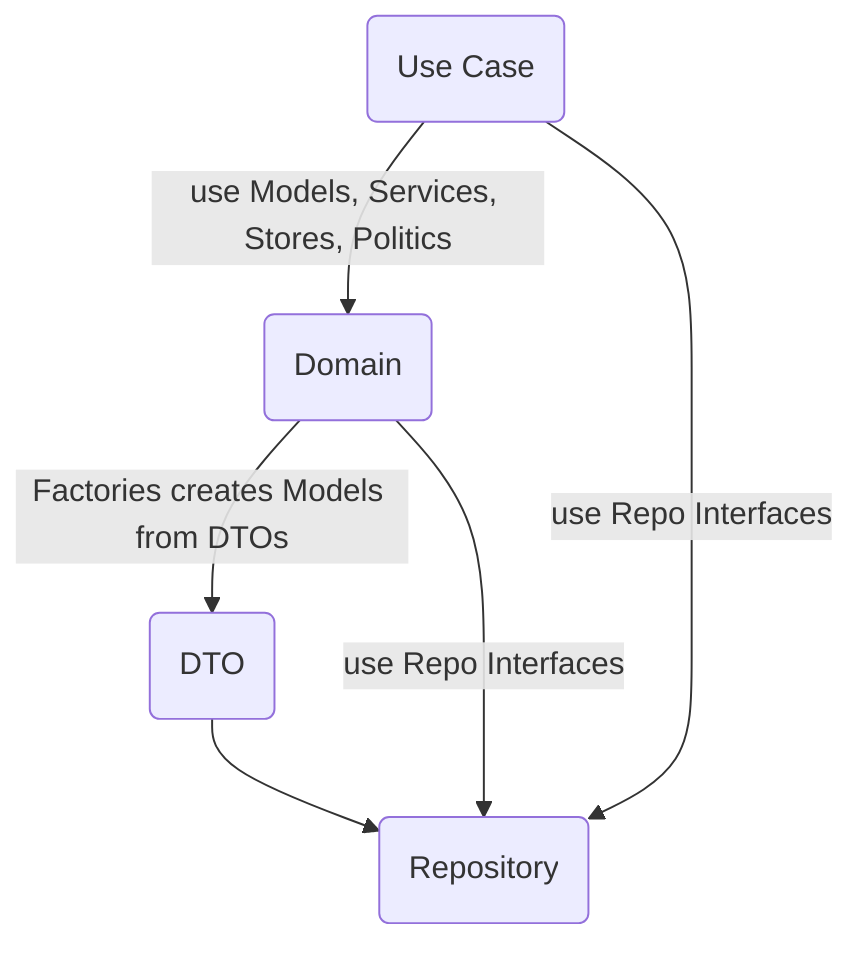

import {Callout, Tab, Tabs} from 'nextra/components'
import {LatestReadings} from "../../../components/ui/sections/latest-readings";

# DRD Architecture

*QUAK developed DRD architecture (DTO's Repository Domain) for SPA frontend.*

## What is DRD?

Example of DRD Architecture for `users` feature:

### Graph



### Description

<Callout emoji="👾" type="info">
  **DRD Architecture** is made as an elevation of **DDD** (Domain Driven Design) to frontend. It is based on **Reactivity** and **DDD** vision.
</Callout>

DRD split business logic from presentation layer/use case. DRD is framework agnostic architecture that can be used in any programming language.

DRD focus on models that have business bahavior and proper abstraction for managing data from `BACKEND` &rarr; `FRONTEND`.

DRD makes views creation simple, secure and fast.

## Why?

- **Easy to maintain** - you can easily change field names in translations layer (DTO) and it will be automatically changed in all other layers, etc.
- **Easy to test** - you can easily test each layer because it is regulary single responsibility cases
- **Easy to understand** - you can easily understand what is going on in each layer
- **Easy to scale** - you can easily add any new views once you created proper foundation
- **Beautiful models** - finally you can have beautiful models with methods and not only data
- **Reactivity** - you can easily react to any change in store, your views are always up to date and way simpler

## When?

- **When you have frontend client** - DRD Architecture makes sense only if you have separate frontend client, like SPA or mobile app
- **Complexity** - DRD Architecture makes sense for small and enterprise projects, but not for simple projects (let HTML and JS/TS be the king in simple apps)

## Example

*Example common feature: `users`*

<Tabs selectedIndex={6} items={['DTO /types', 'DTO fetch-user', 'DTO create-user', 'Repository user', 'Domain user', 'Domain policy', 'Domain user-creation']}>
  <Tab>
  ```typescript
    type UserID = string;
    type Role = "admin" | "user" | "moderator";
  ```
  </Tab>
  <Tab>
  ```typescript
  import {UserID, Role} from './types';

  type FetchUserResponse = {
    id: UserID;
    user_name: string;
    roles: Role[];
  };

  class FetchedUserDto {
    id: UserID;
    username: string;
    roles: Role[];

    constructor(dto: FetchUserResponse) {
      this.id = dto.id;
      this.username = dto.user_name;
      this.roles = dto.roles;
    }
  };
  ```
  </Tab>
  <Tab>
  ```typescript
  import {UserID, Role} from './types';

  type CreateUserResponse = {
    id: UserID;
    user_name: string;
    roles?: Role[];
  };

  class CreateUserDto {
    user_name: string;
    roles: Role[];

    constructor(username: string, roles: Role[]) {
      this.user_name = username;
      this.roles = roles;
    }
  };

  class CreatedUserDto {
    id: UserID;
    username: string;
    roles: Role[];

    constructor(dto: CreateUserResponse) {
      this.id = dto.id;
      this.username = dto.user_name;
      this.roles = dto.roles;
    }
  };
  ```
  </Tab>
  <Tab>
  ```typescript
  interface UserRepository {
    fetchOne(id: UserID): Promise<FetchedUserDto>;
    create(dto: CreateUserDto): Promise<CreatedUserDto>;
  }

  class UserRepositoryService implements UserRepository {
    async fetchOne(id: UserID): Promise<FetchedUserDto> {
      return await fetch(`/api/users/${id}`)
        .then((response) => response.json())
        .then((response) => new FetchedUserDto(response));
    }

    async create(dto: CreateUserDto): Promise<CreatedUserDto> {
      return await fetch(`/api/users`, {
          method: 'POST',
          body: JSON.stringify(dto),
      })
        .then((response) => response.json())
        .then((response) => new CreatedUserDto(response));
    }
  }
  ```
  </Tab>
  <Tab>
  ```typescript
  import {UserID, Role} from './types';

  class User {
    id: UserID;
    username: string;
    roles: Role[];

    constructor(user: User) {
      Object.assign(this, user);
    }

    hasRole(role: Role): boolean {
      return this.roles.includes(role);
    }

    static async create(username: string, roles: Role[], service: CreateUser): Promise<User> {
      return await service.createUser(username, roles);
    }
  }

  const UserFactory = {
    fromFetchedUser(dto: FetchedUserDto): User {
      return new User({
        id: dto.id,
        username: dto.username,
        roles: dto.roles,
      });
    },
    fromCreatedUser(dto: CreatedUserDto): User {
      return new User({
        id: dto.id,
        username: dto.username,
        roles: dto.roles,
      });
    }
  };
  ```
  </Tab>
  <Tab>
  ```typescript
  class UserCreationPolicy {
      readonly minUsernameLength = 3;
  }
  ```
  </Tab>
  <Tab>
  ```typescript
  interface CreateUser {
    createUser(username: string, roles: Role[]): Promise<User>;
  }

  class UserCreationService implements CreateUser {
    constructor(
        private policy: UserCreationPolicy,
        private userRepo: UserRepository,
    ) {}

    async createUser(username: string, roles: Role[]): Promise<User> {
      if (username.length < this.policy.minUsernameLength) {
        throw new Error('Username is too short');
      }
      const response = await this.userRepo.create(new CreateUserDto(username, roles));
      return UserFactory.fromCreatedUser(response);
    }
  }
  ```
  </Tab>
</Tabs>

### Create User usage

#### DI setup

```typescript
const userRepo = new UserRepositoryService();
const userCreationService = new UserCreationService(new UserCreationPolicy(), userRepo);
```

#### Create User

```typescript
const user = await User.create('John', ['user', 'moderator'], userCreationService);
```

#### Use decorator pattern

In case when you want to add some additional logic to your model, you can use decorator pattern.

```typescript
class SendEmailOnUserCreation implements CreateUser {
  constructor(
    private userCreationService: CreateUser,
    private emailService: EmailService,
  ) {}

  async createUser(username: string, roles: Role[]): Promise<User> {
    const user = await this.userCreationService.createUser(username, roles);
    await this.emailService.sendEmail(user);
    return user;
  }
}
```

When you need another decorator, you can easily add it.

```typescript
class NotifyAdminOnUserCreation implements CreateUser {
  constructor(
    private userCreationService: CreateUser,
    private adminService: AdminService,
  ) {}

  async createUser(username: string, roles: Role[]): Promise<User> {
    const user = await this.userCreationService.createUser(username, roles);
    await this.adminService.notifyAdmin(user);
    return user;
  }
}
```

Then simply use it.

```typescript
const userRepo = new UserRepositoryService();
const createUserWithAnEmail = new SendEmailOnUserCreation(
    userCreationService, new EmailService()
);

const user = await new NotifyAdminOnUserCreation(createUserWithAnEmail, new AdminService())
    .createUser('login', ['moderator']);
```

#### Testing

Since every layer is separated, you can easily test each layer.

```typescript
describe('UserCreationService', () => {
  it('should create user', async () => {
    const userRepo = new TestUserRepositoryService(); // mocked repo
    const userCreationService = new UserCreationService(new UserCreationPolicy(), userRepo);
    const user = await userCreationService.createUser('John', ['user', 'moderator']);
    expect(user).toBeInstanceOf(User);
  });
});
```

<p>This is it! Now you can use your models in views and use cases.</p>

<section className="rounded-2xl bg-lines flex mt-10 mb-20 h-20 w-full"></section>

<LatestReadings />
