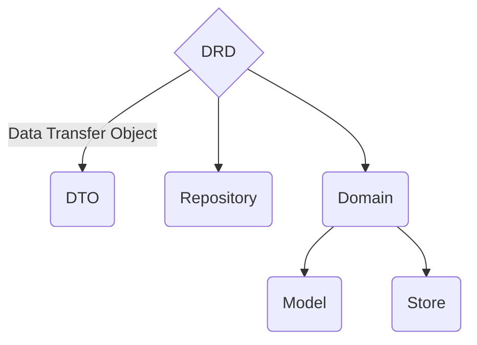
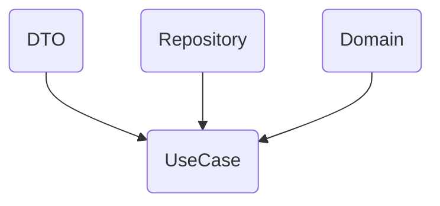

import { Callout } from 'nextra/components'

# DRD Architecture

QUAK developed DRD architecture (DTO's Repository Domain) for frontend.

<Callout emoji="👾" type="info">
  **DRD Architecture** is made as an elevation of **DDD** (Domain Driven Design) to frontend. It is based on **Reactivity** and **DDD** vision.
</Callout>

<Callout emoji="ℹ️" type="info">
    DRD is framework agnostic architecture that can be used in any programming language.
    
    DRD split business logic from presentation layer/use case.
</Callout>

## Why DRD Architecture?

- **Easy to maintain** - you can easily change field names in translations layer (DTO) and it will be automatically changed in all other layers
- **Easy to test** - you can easily test each layer because it is regulary single responsibility cases
- **Easy to understand** - you can easily understand what is going on in each layer
- **Easy to scale** - you can easily add any new feature or even new Layers
- **Beautiful models** - finally you can have beautiful models with methods and not only data
- **Reactivity** - you can easily react to any change in store, your views are always up to date and way simpler

## When to use DRD Architecture?

- **When you have frontend client** - DRD Architecture makes sense only if you have frontend client separate from backend, like SPA or mobile app
- **Complexity** - DRD Architecture makes sense for small and enterprise projects, but not for simple projects (let HTML and JS/TS be the king in simple apps)

## Code examples

Take a look at each layer page to see code examples.

Order:
1. [DTO](/drd/dto)
2. [Repository](/drd/repository)
3. [Domain](/drd/domain)
4. [UseCase](/drd/use-case)