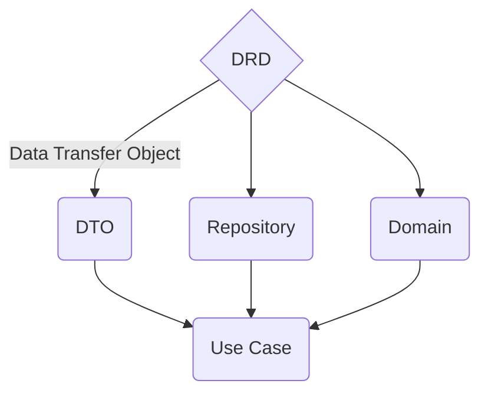

import { Callout } from 'nextra/components'
import { Cards, Card } from 'nextra/components'
import { FileTree } from 'nextra/components'

# DRD Architecture

*QUAK developed DRD architecture (DTO's Repository Domain) for frontend.*

## What is DRD?

### Graph

### Description

<Callout emoji="👾" type="info">
  **DRD Architecture** is made as an elevation of **DDD** (Domain Driven Design) to frontend. It is based on **Reactivity** and **DDD** vision.
</Callout>

DRD split business logic from presentation layer/use case. DRD is framework agnostic architecture that can be used in any programming language.

DRD focus on models that have business bahavior and proper abstraction for managing data from `BACKEND` &rarr; `FRONTEND`.

DRD makes views creation simple, secure and fast.

## Why?

- **Easy to maintain** - you can easily change field names in translations layer (DTO) and it will be automatically changed in all other layers, etc.
- **Easy to test** - you can easily test each layer because it is regulary single responsibility cases
- **Easy to understand** - you can easily understand what is going on in each layer
- **Easy to scale** - you can easily add any new views once you created proper foundation
- **Beautiful models** - finally you can have beautiful models with methods and not only data
- **Reactivity** - you can easily react to any change in store, your views are always up to date and way simpler

## When?

- **When you have frontend client** - DRD Architecture makes sense only if you have separate frontend client, like SPA or mobile app
- **Complexity** - DRD Architecture makes sense for small and enterprise projects, but not for simple projects (let HTML and JS/TS be the king in simple apps)

## Layers

Take a look at each layer page to see layer explanation with code examples.

<Cards>
  <Card title="👤 1. DTO" href="/learn/architecture/drd-frontend/dto" />
  <Card title="🏪 2. Repository" href="/learn/architecture/drd-frontend/repository" />
  <Card title="💰 3. Domain" href="/learn/architecture/drd-frontend/domain" />
  <Card title="📈 4. Use Case" href="/learn/architecture/drd-frontend/use-case" />
</Cards>

## Example

### Folder structure

<FileTree>
  <FileTree.Folder name="src" defaultOpen>
    <FileTree.Folder name="features" defaultOpen>
      <FileTree.Folder name="users" defaultOpen>

        <FileTree.Folder name="dto">
          <FileTree.Folder name="types">
            <FileTree.File name="user-id.ts" />
            <FileTree.File name="fetch-user-response.ts" />
            <FileTree.File name="fetch-user-list-response.ts" />
          </FileTree.Folder>
          <FileTree.File name="user.dto.ts" />
          <FileTree.File name="user-list-item.dto.ts" />
          <FileTree.File name="fetch-user-list.dto.ts" />
        </FileTree.Folder>
        <FileTree.Folder name="repo">
          <FileTree.Folder name="types">
            <FileTree.File name="user-repository.interface.ts" />
          </FileTree.Folder>
          <FileTree.File name="user.repository.ts" />
        </FileTree.Folder>
        <FileTree.Folder name="domain">
          <FileTree.File name="user.model.ts" />
          <FileTree.File name="users-list-item.model.ts" />
          <FileTree.File name="users-list.store.ts" />
          <FileTree.File name="create-user.service.ts" />
        </FileTree.Folder>
      
      </FileTree.Folder>
    </FileTree.Folder>

    <FileTree.Folder name="views" defaultOpen>
      <FileTree.Folder name="users" defaultOpen>
        <FileTree.File name="users-list-view.component.ts" />
        <FileTree.File name="user-details-view.component.ts" />
      </FileTree.Folder>
    </FileTree.Folder>
  </FileTree.Folder>
</FileTree>

### Angular Example Repo

[DRD - Example Angular GitHub Repo](https://github.com/Walikuperek/DRD-frontend-architecture)

