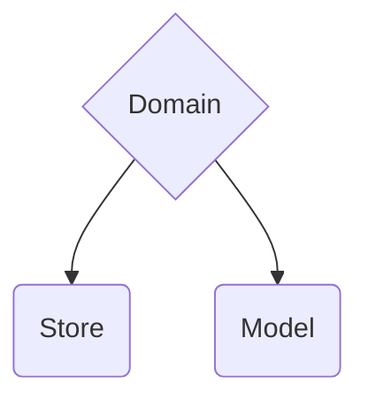

# Third layer - domain layer

import { Callout } from 'nextra/components'
 
<Callout emoji="ℹ️" type="info">
    Models are our business logic layer. They are the core of our application. Take a look at that models methods are moslty POST calls.

    Stores represents our data in views. Stores are reactive source of data which makes (GET) requests to fetch on e.g. action fetchUserByID.
</Callout>




## What is a model?

Well, a model is a class that represents a business entity. It can be a user, a product, a company, etc. It is the core of our application. It is the layer that contains the business logic of our application.

### Value Object

UserProfile is a Value Object - Domain Driven Design - [DDD](https://en.wikipedia.org/wiki/Domain-driven_design) - [Martin Fowler ValueObject](https://martinfowler.com/bliki/ValueObject.html).

Value Objects aggregates some data together and is immutable. It is a good practice to use Value Objects to represent data that is not going to change. In this case, the user profile is a good example of a Value Object.

```typescript
class UserProfile {
    userName: string

    constructor(dto: UserProfileDTO) {
        this.userName = dto.userName
    }

    getOrganizationName() {
        return this.userName.split('@')[0] // This is just an example
    }
}
```

### Model

Actual Model is a class with business logic. Methods are mostly POST calls. Model is just a class with some logic, that's it.

```typescript
class User {
    id: UserID
    profile: UserProfile

    constructor(dto: UserDTO) {
        this.id = dto.id
        this.profile = new UserProfile(dto.profile)
    }
    
    updateProfile(profile: UserProfile, userRepo: UserRepositoryInterface) {
        // Connects UserRepository to User model 
        // -> it will be easier for next developers to reuse the code
        return userRepo.update(profile).pipe(map(res => {
            this.profile = profile
            return this
        }))
    }
}
```

Ok... but it's simple and it's just a class. What's the point?

Look how you can use it:

```typescript
user.updateProfile(new UserProfile({ userName: 'newUserName' }), userRepo)
    .subscribe(user => {
        // Do something with the user
    })
```

### Models are not just classes

FileStorage is a model too. This approach will result in removing a lot of services.

```typescript
function FileStorage(repo: FileStorageRepository) {
    return {
        upload: (file: File) => {
            return repo.upload(file)
        },

        // don't use here store.settings.isDemo(), etc. -> stores are available only in use case layer
        download(id: FileID) {
            return repo.download(id)
        }
    }
}

// Use Case layer
class ViewComponent {
    constructor(
        private fileRepo: fileStorageRepo,
        private userStore: UserStore
    ) {}

    download(id: FileID) {
        const userIsAdmin = this.userStore.values.currentUser.isAdmin()
        const isAllowed = userIsAdmin || this.userStore.values.currentUser.isAllowedToDownload()

        if (!isAllowed) throw new Error('Not allowed')
        
        const fileStorage = FileStorage(this.fileRepo)
        fileStorage.download(id, fileStorageRepo)
            .subscribe(res => {
                // Do something with the response
            })
    }
}
```

### Proper Models replaces services

Below class could be split into Flight (data bucket) and FlightService somewhere. After some time this service would have 15 methods and it would be a mess.

```typescript
class Flight {
    id: FlightID
    name: string
    departure: Date
    arrival: Date

    constructor(dto: FlightDTO) {
        this.id = dto.id
        this.name = dto.name
        this.departure = dto.departure
        this.arrival = dto.arrival
    }

    bookSeat(seat: Seat, flightRepo: FlightRepositoryInterface) {
        return flightRepo.bookSeat(this.id, seat)
    }
}
```

Don't be afraid to create a new model - don't put all of it into one service with dumb data classes.

Remember that bookSeat and checkIn are different use cases. They should be separated.

```typescript
class SeatCheckIn {
    id: SeatCheckInID
    seat: Seat
    passenger: Passenger

    constructor(dto: SeatCheckInDTO) {
        this.id = dto.id
        this.seat = dto.seat
        this.passenger = dto.passenger
    }

    checkIn(flightRepo: FlightRepositoryInterface) {
        return flightRepo.checkIn(this)
    }
}
```

## What is store?

 
<Callout emoji="🏗️">
  **QUAK** is working on it ...in_progress...
</Callout>