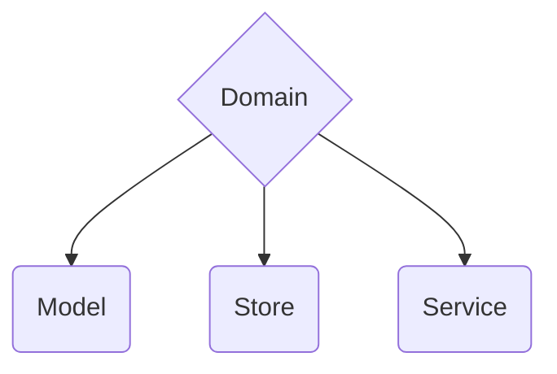

import { Callout } from 'nextra/components'
import { FileTree } from 'nextra/components'
import { Tabs, Tab } from 'nextra/components'
import { Cards, Card } from 'nextra/components'

# Third layer - domain layer
 


<Cards>
  <Card title="👤 Model" href="/learn/architecture/drd-frontend/domain/#model" />
  <Card title="🏪 Store" href="/learn/architecture/drd-frontend/domain/#store" />
  <Card title="🛠 Service" href="/learn/architecture/drd-frontend/domain/#service" />
</Cards>

## Model

Well, a model is a class that represents a business entity that we face on the frontend.

Example models: `user.model.ts`, `cart.model.ts`, `file-item.model.ts`.

<Callout emoji="ℹ️" type="info">
    Take a look that methods are mostly POST/PUT calls.
</Callout>

```typescript
class Model {
    data: number

    update(data: number, repo: ModelRepositoryInterface): Observable<Model> {
        return repo.updateModel(data).pipe(
            tap(response => this.data = data) // update only on succes response
        )
    }
}
```

## Store

Store represents data in views.

<Callout emoji="ℹ️" type="info">
    Stores are reactive source of data which makes (GET) requests and reacts to **actions**.
</Callout>

```typescript
type Data = { data: Model | null }
const DEFAULT: Data = { data: null }

class Store {
    data$ = new BehaviorSubject<Data>(DEFAULT)
    actions = {
        fetchDataForID: new Subject<number>()
    }

    constructor(repo: ModelRepositoryInterface) {
        this.repo = repo
        this.actions
            .fetchDataForID.subscribe(id => this._fetchFor(id))
    }

    private _fetchFor(id: number) {
        this.repo.findOne(id)
            .subscribe(response => this.data$.next(response)) // update data
    }
}
```

## Service

<Callout emoji="ℹ️" type="info">
    Services is useful when we need to glue up two or more models/services/etc together.
</Callout>

<Callout emoji="🏗️">
  **QUAK** is working on it.
</Callout>
