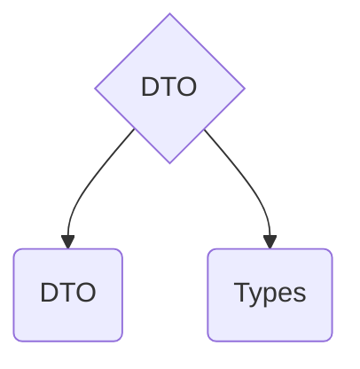

import { Callout } from 'nextra/components'
import { FileTree } from 'nextra/components'
import { Tabs, Tab } from 'nextra/components'
import { Cards, Card } from 'nextra/components'

# First layer - translations layer



<Cards>
  <Card title="👤 DTO" href="/learn/architecture/drd-frontend/dto/#dto" />
  <Card title="📝 Types" href="/learn/architecture/drd-frontend/dto/#types" />
</Cards>

## What for?

DTO (Data Transfer Object) layer is used for e.g.:
- currently logged in user

```FetchUserResponse -> new UserDto(response) -> UserFactory.fromUserDto(dto)```

<em>* factory from domain layer</em>

- list of users

```FetchUserListResponse -> new UserListDto(response) -> dto.users.map(user => new UserListItem(user))```

<em>* UserListItem from domain layer</em>
 
<Callout emoji="👾">
  **REMBER** don't use same model for 2 things. User isn't UserListItem.
</Callout>

## DTO

DTO - Data Transfer Object - it is a class that is resposible for tranlsating incoming responses to our models.

Example DTOs: `find-users.dto.ts`, `user-profile.dto.ts`, `user.dto.ts`.

<Callout emoji="ℹ️" type="info">
    DTO/Translations layer is responsible for managing incoming data shape and encapsulating changes.
</Callout>

```typescript
class UserDto {
    id: UserID
    username: string
    address: AddressDto

    constructor(response: FetchUserResponse) {
      this.id = response.id
      this.username = response.user_name
      this.address = AddressDto.fromFetchUserResponse(response)
    }

    static fromResponse(res: FetchUserResponse): UserDto {
      return new UserDto(res)
    }
}
```

## Types

Types in translation layer are: 
- responses
- inner types, like `UserID`

```typescript
type UserID = string

type FetchUserResponse = {
  id: UserID
  username: string
  address: AddressResponseObject
}

type AddressResponseObject = {
  street: string;
  city: string;
}
```

## Example

*Example common feature: `users`*

<FileTree>
  <FileTree.Folder name="dto" defaultOpen>
    <FileTree.Folder name="types" defaultOpen>
      <FileTree.File name="user-id.ts" />
      <FileTree.File name="fetch-user-response.ts" />
    </FileTree.Folder>
    <FileTree.File name="user.dto.ts" />
    <FileTree.File name="address.dto.ts" />
  </FileTree.Folder>
</FileTree>

<Tabs items={['user.dto.ts', 'adress.dto.ts', 'fetch-user-response.ts', 'user-id.ts']}>
  <Tab>
  ```typescript
  class UserDto {
    id: UserID;
    username: string;
    address: AddressDto;

    constructor(response: FetchUserResponse) {
      this.id = response.id;
      this.username = response.user_name;
      this.address = AddressDto.fromFetchUserResponse(response);
    }

    static fromResponse(res: FetchUserResponse): UserDto {
      return new UserDto(res);
    }
  }
  ```
  </Tab>
  <Tab>
  ```typescript
  class AdressDto {
    street: string;
    city: string;

    constructor(from: AdressDto) {
      this.street = from.street;
      this.city = from.city;
    }

    static fromFetchUserResponse(res: FetchUserResponse): AdressDto {
      return new AdressDto({
        street: res.address.street,
        city: res.address.city
      });
    }
  }
  ```
  </Tab>
  <Tab>
  ```typescript
  type FetchUserResponse = {
    id: UserID;
    username: string;
    address: AddressResponseObject;
  }

  type AddressResponseObject = {
    street: string;
    city: string;
  }
  ```
  </Tab>
  <Tab>
  ```typescript
  type UserID = string;
  ```
  </Tab>
</Tabs>