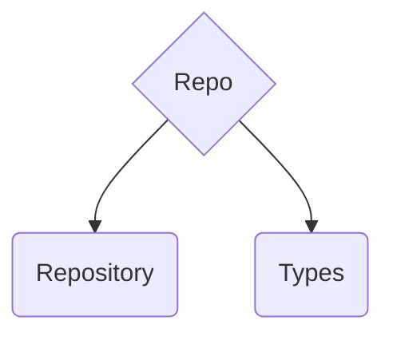

import { Callout } from 'nextra/components'
import { FileTree } from 'nextra/components'
import { Tabs, Tab } from 'nextra/components'
import { Cards, Card } from 'nextra/components'

# Second layer - repository layer



<Cards>
  <Card title="🏪 Repository" href="/learn/architecture/drd-frontend/repository/#repository" />
  <Card title="📝 Types" href="/learn/architecture/drd-frontend/repository/#types" />
</Cards>

## What for?

Repo layer is used for e.g.:
- fetching list of users

```UserRepository.find(userSearchFilter) -> FindUsersDto```

- upload file

```FileRepository.upload(file) -> UploadFileDto```
 
<Callout emoji="👾">
  **REMBER** always return DTOs from repository &rarr; models are created from DTOs.
</Callout>

## Repository

Repository - is a service that handles HTTP request to our persistance layer (database, fileStorage, etc).

Example Repositories: `user.repository.ts`, `file.repository.ts`, `analitics.repository.ts`.

<Callout emoji="ℹ️" type="info">
  You can omit reactivity and use Promises instead of Observable.
</Callout>

```typescript
class UserRepository implements UserRepositoryInterface {
    constructor(private readonly http: HttpClient) {}

    find(where: FindUsersFilter): Observable<FindUsersDto> {
        return this.http
            .get<FindUserResponse[]>(`${environment.api}/users`, {params: where})
            .pipe(map(FindUsersDTO.fromResponse))
    }
    create(user: CreateUserBody): Observable<CreateUserDto> {...}
    update(user: UpdateUserBody): Observable<UpdateUserDto> {...}
    delete(id: UserID): Observable<void> {...}
}
```

## Types

Types in repository layer are: 
- repository interfaces
- inner types libe ...Body, ...Filter, ...Params, etc.

<Callout emoji="ℹ️" type="info">
  Declare repository interface for easy data provider swap.
</Callout>

```typescript
interface UserRepositoryInterface {
    find(where: FindUsersFilter): Observable<FindUsersDto>
    create(user: CreateUserBody): Observable<CreateUserDto>
    update(user: UpdateUserBody): Observable<UpdateUserDto>
    delete(id: UserID): Observable<void> // UserID from translations layer
}
```

## Example

*Example common feature: `users`*

<FileTree>
  <FileTree.Folder name="repo" defaultOpen>
    <FileTree.Folder name="types" defaultOpen>
      <FileTree.File name="user-repository.interface.ts" />
      <FileTree.File name="find-users-filter.ts" />
    </FileTree.Folder>
    <FileTree.File name="user.repository.ts" />
  </FileTree.Folder>
</FileTree>

<Tabs items={['user.repository.ts', 'user-repository.interface.ts', 'find-users-filter.ts']}>
  <Tab>
  ```typescript
  class UserRepository implements UserRepositoryInterface {
    constructor(private http: HttpClient) {}

    findOne(urlSafeID: UserID): Observable<UserDTO> {
      return this.http
        .get<FindUserResponse>(`/api/users/${urlSafeID}`)
        .pipe(map(UserDTO.fromResponse));
    }

    find(where: Partial<FindUsersFilter>): Observable<FindUsersDTO> {
      return this.http
        .get<FindUserResponse[]>('/api/users', { params: where })
        .pipe(map(FindUsersDTO.fromResponse));
    }

    update(user: UpdateUserBody): Observable<UpdateUserDto> {
      return this.http
        .put<UpdateUserResponse>(`/api/users/${user.id}`, user)
        .pipe(map(response => new UpdateUserDto(response)));
    }
  }
  ```
  </Tab>
  <Tab>
  ```typescript
  interface UserRepositoryInterface {
    findOne(urlSafeID: UserID): Observable<UserDTO>;
    find(where: Partial<FindUsersFilter>): Observable<FindUsersDTO>;
    update(user: UpdateUserBody): Observable<UpdateUserDto>;
  }
  ```
  </Tab>
  <Tab>
  ```typescript
  type Filter = {
    readonly id: string;
    readonly username: string;
    readonly role: UserRole;
    readonly page: number;
    readonly limit: number;
  }

  class FindUsersFilter {
    readonly id: string;
    readonly username: string;
    readonly role: UserRole;
    readonly page: number;
    readonly limit: number;

    constructor(filters?: Partial<Filter>) {
      this.id = filters?.id || '';
      this.username = filters?.username || '';
      this.role = filters?.role || 'guest';
      this.page = filters?.page || 1;
      this.limit = filters?.limit || 10;
    }
  }
  ```
  </Tab>
</Tabs>
