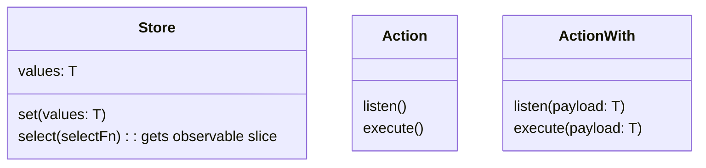

import Image from 'next/image'
import { Tab, Tabs } from 'nextra-theme-docs'
 

# Qstore

<p align="center">
    <Image src="/docs/qstore_logo.png" alt="Hello" width={100} height={100} />
</p>

* [Qstore GitHub repository](https://github.com/Walikuperek/Qstore)
* [Qstore NPM package](https://www.npmjs.com/package/@quak.lib/qstore)

~3kb.js library for state management based on RxJS. It's a simple and lightweight alternative to Redux, MobX, Vuex, etc. Use it if it fits your needs.

## Install
<Tabs items={['npm']}>
  <Tab>
    ```bash
    npm install @quak.lib/qstore
    ```
  </Tab>
</Tabs>
<br />

## What is Qstore?
It's library for state management. Builded mainly for Angular but it can be used in any other framework or even without any framework.

### Interfaces



## Create store

```typescript
import {Store} from '@quak.lib/qstore';

@Injectable({providedIn: 'root'}) // Angular way of providing global services
class ProductStore extends Store<{products: Product[]}> {
    products$ = this.select(state => state.products);
    actions = {
        addProduct: ActionWith<Product>(),
        removeProduct: ActionWith<Product>(),
        resetProducts: Action()
    };
    
    constructor() {
        super({products: []});
        
        this.actions.addProduct.listen()
            .subscribe(product => {
                this.set({products: [...this.values.products, product]});
            });
            
        this.actions.removeProduct.listen()
            .subscribe(product => {
                this.set({products: this.values.products.filter(p => p.id !== product.id)});
            });

        this.actions.resetProducts.listen()
            .subscribe(() => {
                this.set({products: []});
            });
    }
}
```

## Use store

```typescript
@Component({
    selector: 'app-product-list',
    template: `
        <div *ngFor="let product of products$ | async">
            <app-product [product]="product"></app-product>
        </div>
    `
})
class ProductListComponent {
    products$ = this.productStore.products$;
    
    constructor(private productStore: ProductStore) {}
}
```

```typescript
@Component({
    selector: 'app-product',
    template: `
        <div>
            <h3>{{product.name}}</h3>
            <button (click)="removeProduct()">Remove</button>
        </div>
    `
})
class ProductComponent {
    @Input() product: Product;
    
    constructor(private productStore: ProductStore) {}
    
    removeProduct() {
        this.productStore.actions.removeProduct.execute(this.product);
    }
}
```

```typescript
@Component({
    selector: 'app-product-add',
    template: `
        <div>
            <input [(ngModel)]="name">
            <button (click)="addProduct()">Add</button>
        </div>
    `
})
class ProductAddComponent {
    name: string;
    
    constructor(private productStore: ProductStore) {}
    
    addProduct() {
        this.productStore.actions.addProduct.execute({name: this.name});
    }
}
```

```typescript
@Component({
    selector: 'app-product-reset',
    template: `
        <div>
            <button (click)="resetProducts()">Reset</button>
        </div>
    `
})
class ProductResetComponent {
    constructor(private productStore: ProductStore) {}
    
    resetProducts() {
        this.productStore.actions.resetProducts.execute();
    }
}
```


## License

[MIT LICENSE](https://github.com/Walikuperek/Qstore/blob/master/LICENSE)

Made & maintained with ❤️ by [QUAK](https://quak.com.pl)